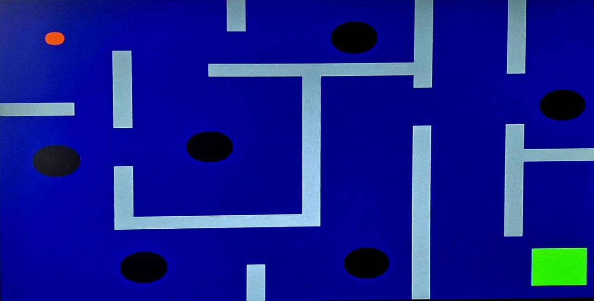

<!--TITLE-->
 

<h3 align="center">Labyrinth</h3>

 

 

This project was developed for the Advanced Logic Design course taught by Prof. Roberto Passerone from Unitn. It implements a complete System-on-a-Chip (SoC) on a Digilent Nexys 4 DDR FPGA (Xilinx Artix-7). 

The core of the system is a custom-designed, single-cycle **RISC-V RV32I processor** written in VHDL from scratch. The processor serves as the brain for an interactive bare-metal video game: a "Labyrinth" where the user must guide a ball from a starting point to a finish line, carefully avoiding walls and holes. 

The system highlights a strong Hardware/Software Co-Design approach:
* **Hardware:** The physical inclination of the board is constantly monitored using the onboard ADXL362 3-axis accelerometer, managed by a custom SPI controller. A custom VGA controller handles the real-time rendering of the 640x480 resolution maze and the ball. Memory-mapped I/O is used to communicate with all peripherals, including a GPIO module for LEDs and a 7-segment display.
* **Software:** A highly optimized C firmware runs directly on the RISC-V CPU, reading the accelerometer data to compute the game physics (including ball inertia and friction using bitwise shift operations) and resolving wall/hole collisions. 

A custom VGA controller handles the real-time rendering of the 640x480 resolution maze and the ball
. Memory-mapped I/O is used to communicate with all peripherals, including a GPIO module for LEDs and a 7-segment display
.
Software: A highly optimized C firmware runs directly on the RISC-V CPU, reading the accelerometer data to compute the game physics (including ball inertia and friction using bitwise shift operations) and resolving wall/hole collisions
.
